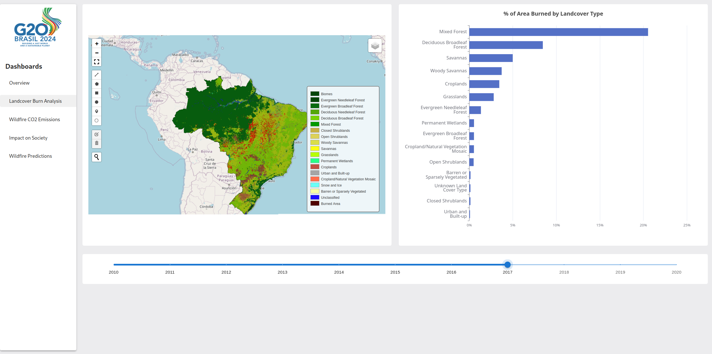
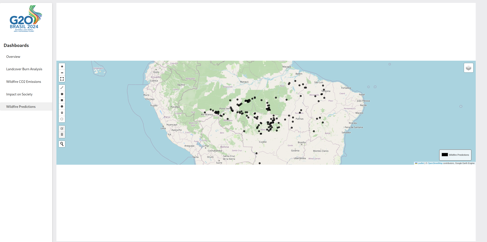
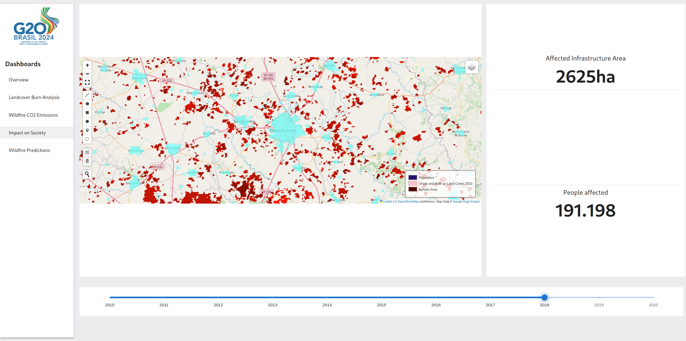
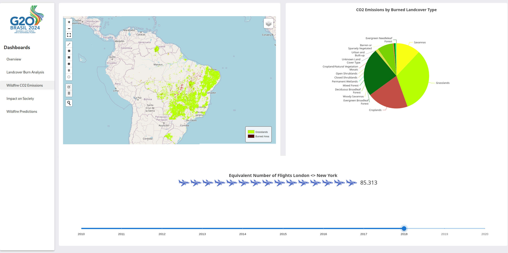

# StartHack24

Our solution for StartHack G20's challenge. This repository contains the code for the project.

## Project Details

Our project leverages data from the Google Earth Engine and NASA to predict future fire occurrences in Brazil. We use machine learning techniques to analyze and visualize the data, providing insights into potential fire hotspots.

### File Structure

- **app**: Contains the backend through which the frontend communicates with the Google Earth Engine data. Written in _Python_.
- **challange_tasks**: Contains the tasks for the challenge.
  - **task1_binaryclassifier**: Contains the binary classifier for task 1.
  - **task2**: Analysis where we use the Google Earth Engine to create the data for the later visualization.
  - **predict_future_fires.ipynb**: Clustering and prediction of future fires using NASA data (https://firms.modaps.eosdis.nasa.gov/active_fire/).
- **frontend**: Contains the frontend for the project, written in _React_.

## Setup

### Frontend

1. Navigate to the `frontend` directory:
    ```sh
    cd frontend
    ```
2. Install the dependencies:
    ```sh
    npm install
    ```
3. Start the frontend:
    ```sh
    npm run start
    ```

### Backend

1. Create a conda environment from the provided `environment.yml` file:
    ```sh
    conda env create -f app/environment.yml
    ```
2. Activate the conda environment:
    ```sh
    conda activate starthack2024
    ```
3. Specify the Google Earth Engine project in the `.env` file located in the `app` directory. Set the `GEE_PROJECT` variable to your Google Earth Engine project ID.
4. Run the backend:
    ```sh
    cd app
    ```
    ```sh
    python app/app.py
    ```

### Screenshots

Here are some screenshots of our project:

|  |  |
|------------------------------------------|------------------------------------------|
|  |  |
|  |                                          |

### Our Demo

Watch our demo on YouTube: https://youtu.be/ytJv9hX5TMA

### Credits

This project was developed by:
- **[Mauro Leidi](https://github.com/MauroLeidi)**
- **[Gioele Monopoli](https://github.com/ogimgio)**
- **[Mariz Awad](https://github.com/marzi333)**
- **[Johannes Getzner](https://github.com/JohannesGetzner)**